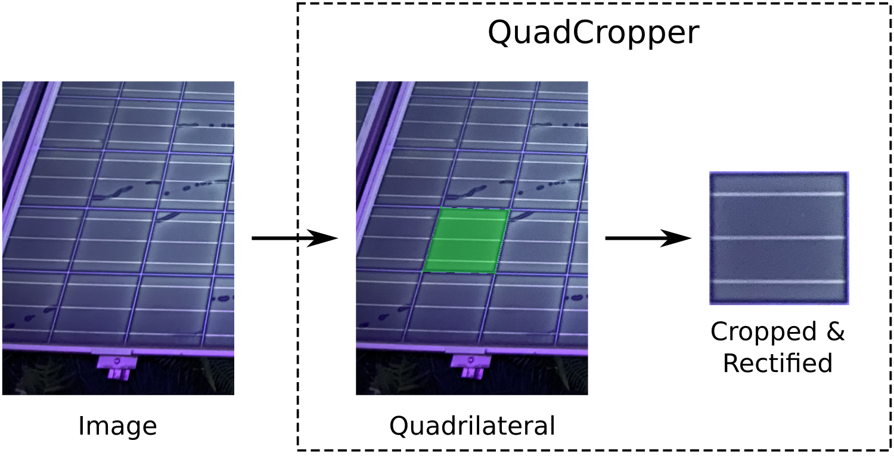

# QuadCropper

QuadCropper is a desktop app for cropping and rectifying quadrilaterals (polygon with four corners) from images. You can annotate arbitrary quadrilaterals and crop the underlying image region. The region is projected to a rectangle using a [homography](https://docs.opencv.org/4.x/d9/dab/tutorial_homography.html). This corrects for perspective distortion of the image resulting in an orthogonal view.



## Installation

This app requires [Python 3](https://www.python.org/downloads/) to be installed on your machine.

We recommend installing QuadCropper in a Python virtual environment, which you can create with the following command in a new terminal
```
python3 -m venv env
```
On Linux and macOS, you can activate the enviroment with
```
source env/bin/activate
```
on Windows type
```
.\env\Scripts\activate
```

Inside the activated environment upgrade pip
```
python3 -m pip install --upgrade pip
```
and then install QuadCropper via pip
```
python3 -m pip install --upgrade quadcropper
```
Note, that depending on your platform you will have to replace `python3` with `python` or `py` in the commands above.


## Usage

### Start QuadCropper

Open a terminal and navigate to the installation directory of QuadCropper. Activate the Python virtual environment with 
```
source env/bin/activate
```
on Linux or
```
.\env\Scripts\activate
```
on Windows.

Then, start QuadCropper with the command
```
quadcropper
```

### Open an Image Directory 

Place the image you want to annotate in a directory. This directory must only contain the images and nothing else. To open this directory in QuadCropper click "File" -> "Open Folder..." in the menu bar and navigate to the directory in the file dialog that pops up. After hitting "Open" in the file dialog, names of all images are shown in the "Images" list on the left.

### Annotate Quadrilaterals

Select the image you want to annotate in the "Images" list on the left. To draw a quadrilateral, click into the image to mark all four corner points. You can use the mouse wheel to scroll in and out of the image for more accurate annotations. After the forth corner point is set, the quadrilateral is drawn in green and shows up in the "Quadrilaterals" list on the left.

To abort drawing a quadrilateral before the forth point is set, you can either hit the "Esc" key or change the image selection in the "Images" list on the left.

If you want to correct a quadrilateral, select it in the "Quadrilaterals" list and click the "Delete Selected" button. You can also delete all quadrilaterals in the selected image with the "Delete All" button.

To delete all annotations of the entire dataset, click "Actions" -> "Clear All Quadrilaterals" in the menu bar and confirm the warning dialog that pops up.

### Crop and Rectify Quadrilaterals

After you annotated all images, click the "Crop All" button on the left. A file dialog pops up, in which you create/navigate to an empty folder. After hitting "Open" in the file dialog, all annotated quadrilaterals are cropped. The cropped patches are stored in the selected folder. Names of the patches are the original image name concatenated with a random alphanumerical ID.

By default, patch sizes are derived from the size of the annotated quadrilateral ("Automatic patch size" checkbox). You can also uncheck the checkbox and provide a custom width and height to which the cropped patches are scaled.

### Closing the Image Directory

After you are done with the steps above, you can close the image directory by clicking "File" -> "Close Folder" in the menu bar. You can now open another image folder for annotation.

### Note on Updating the Images

The "Images" list is not updated if you add or delete images from the opened image directory. If you add or delete images, you have to close and reopen the image directory in QuadCropper to account for the changes in the image directory.


## About

This software is written by Lukas Bommes, M.Sc. - [Helmholtz Institute Erlangen-Nürnberg for Renewable Energy (HI ERN)](https://www.hi-ern.de/hi-ern/EN/home.html)

### License

This project is licensed under the MIT License - see the [LICENSE](https://github.com/LukasBommes/Quad-Cropper/blob/master/LICENSE) file for details.

### Build with
- [Python](https://www.python.org/)
- [Qt for Python](https://www.qt.io/qt-for-python)